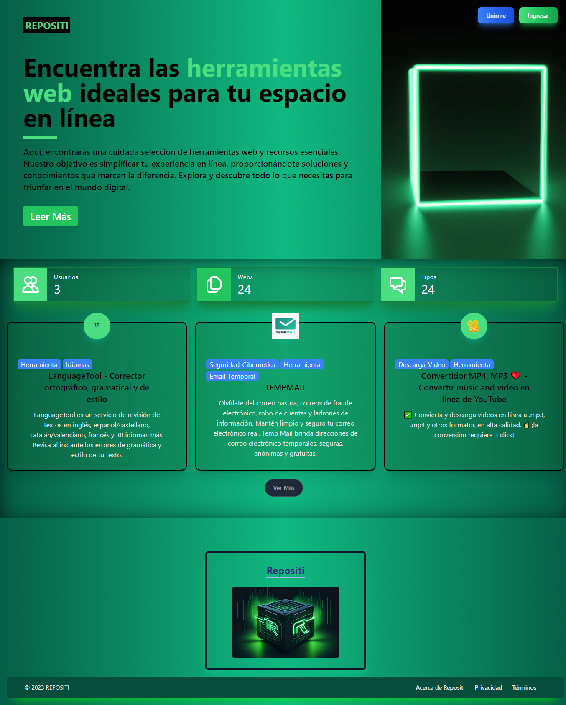
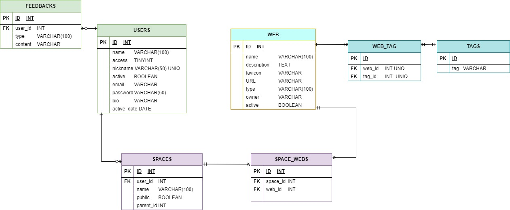

# Repositi

Repositi es una plataforma que recopila y comparte información sobre herramientas web útiles y recursos en línea. Proporciona a los usuarios una fuente confiable de herramientas y recursos que pueden facilitar su trabajo, mejorar su productividad y enriquecer su experiencia en línea.

## Demostración

video: https://youtu.be/GcszADbJKTo

## Características Destacadas

### Registro e Inicio de Sesión:
- Los usuarios pueden crear cuentas y acceder fácilmente a sus perfiles personalizados.

### Gestión de Perfil:
- Perfil de usuario mejorado con opciones de edición para agregar detalles personales, incluyendo una breve biografía y foto de perfil.

### Exploración de Webs:
- Navegación sencilla a través de una lista completa de webs disponibles, con opciones de búsqueda para encontrar rápidamente lo que están buscando.

### Funcionalidades de Favoritos:
- Capacidad para agregar y eliminar webs de una lista de favoritos, permitiendo a los usuarios mantener un registro de sus sitios preferidos.

### Feedback y Recomendaciones:
Los usuarios pueden proporcionar feedback sobre las webs y recomendar sitios a los para que los administradores lo agreguen.

### Para Administradores:
### Control Total:
- Los administradores tienen acceso total para realizar acciones como agregar, editar y eliminar webs, tags y feedbacks.

### Moderación de Contenido:
- Sistema de moderación para revisar y aprobar las webs antes de que se recomienden, manteniendo la calidad y relevancia del contenido.

## Tecnologías Utilizadas
- Laravel
- Livewire
- Alpine.js
- TailwindCSS
- MySQL

## DB

